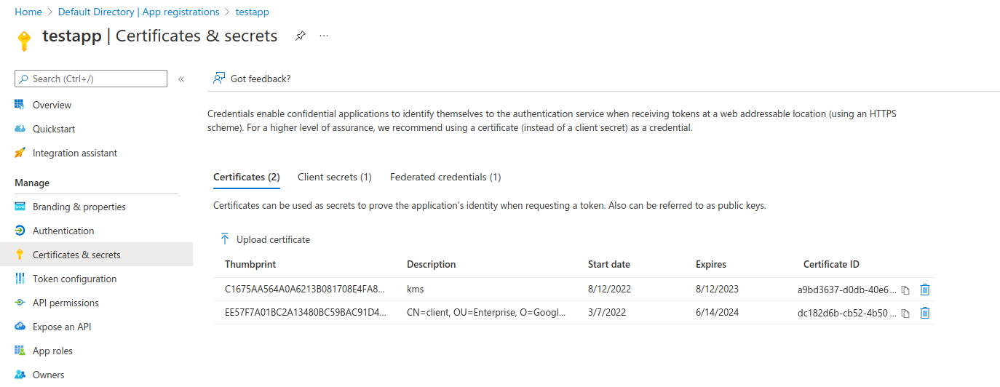

## KMS, TPM and HSM based Azure Certificate Credentials 

Azure Credential class that allows you to use HSM, KMS or TPM embedded private keys.  

It allows for Azure API access using any golang construct that fulfils the [crypto.Signer](https://pkg.go.dev/crypto#Signer) interface.

[Microsoft identity platform application authentication certificate credentials](https://docs.microsoft.com/en-us/azure/active-directory/develop/active-directory-certificate-credentials) describes how an admin can associate an `x509.Certificate` with an application and then access Azure API using the private key.

However, the default azure library only allows providing the private key as a raw PEM file (see [azidentity.NewClientCertificateCredential()](https://pkg.go.dev/github.com/Azure/azure-sdk-for-go/sdk/azidentity#NewClientCertificateCredential)).   In other words, the private key is on disk and can be compromised.

This repo allows you to pass in an arbitrary `crypto.Signer` interface instead of the raw key. 

That abstraction allows any underlying backend to hold the private key material.

For example, [go-tpm-tools Signer](https://pkg.go.dev/github.com/google/go-tpm-tools/client#Key.GetSigner)  allows you to embed the private key into a Trusted Platform Module (TPM)

There are plenty of other signers around and some unsupported ones can be found here that show how to use GCP KMS, TPM and just as a demo, a PEM file

* [crypto.Signer, implementations for Google Cloud KMS and Trusted Platform Modules](https://github.com/salrashid123/signer)

To use this, first setup an azure application and upload the public x509.  in the example below, i've uploaded the certs provided in this repo (you can use these keys but really, you should generate your own)



The specific `crypto.Signer` i've used here in the example is silly:  its a `crypto.Signer` that uses a PEM file (which doesn't make that much sense since its equivalent security that `azidentity`).  However, it does implement a signer nonetheless.

I've also shown a `crypto.Signer` that uses my KMS key.

### References

* [Exchange Google and Firebase OIDC tokens for Azure STS](https://github.com/salrashid123/azcompat)
* [golang-jwt for crypto.Signer](https://github.com/salrashid123/golang-jwt-signer)

---

#### Usage


see `example/` folder on usage

```golang
import (
	"github.com/salrashid123/azsigner"
	"github.com/Azure/azure-sdk-for-go/sdk/azcore/policy"
	"github.com/Azure/azure-sdk-for-go/sdk/storage/azblob"    
)

	ksigner := getAnySigner()  // <<<<<<<<<< anything that implements crypto.Signer() for RSA

	cred, err := azsigner.NewSignerCredentials(
		tenantID,
		clientID,
		[]*x509.Certificate{cert},
		ksigner, nil)

	// print the default token
	tk, err := cred.GetToken(context.Background(), policy.TokenRequestOptions{
		Scopes: []string{fmt.Sprintf("api://%s/.default", clientID)},
	})

	fmt.Printf("Azure token: %s\n", tk.Token)

	client, err := azblob.NewClient(url, cred, nil)
	pager := client.NewListBlobsFlatPager(containerName, &azblob.ListBlobsFlatOptions{})

	for pager.More() {
		resp, err := pager.NextPage(context.TODO())
		for _, blob := range resp.Segment.BlobItems {
			fmt.Println(*blob.Name)
		}
	}
```

If you want to acquire an Azure access token for a specific service (like storage), set the scope appropriately:


```golang
	tk, err := cred.GetToken(context.Background(), policy.TokenRequestOptions{
		Scopes: []string{fmt.Sprintf("https://storage.azure.com/.default")},
	})
```

then use the token with curl:

```bash
$ export STORAGE_ACCOUnt=foo
$ export CONTAINER=bar
$ curl -s --oauth2-bearer "$AZURE_TOKEN"  -H 'x-ms-version: 2017-11-09'  \
     "https://$STORAGE_ACCOUnt.blob.core.windows.net/$CONTAINER?restype=container&comp=list" | xmllint -  --format
```

gives:

```xml
<?xml version="1.0" encoding="utf-8"?>
<EnumerationResults ServiceEndpoint="https://STORAGE_ACCOUnt.blob.core.windows.net/" ContainerName="CONTAINER">
  <Blobs>
    <Blob>
      <Name>oven.md</Name>
      <Properties>
        <Creation-Time>Mon, 06 Nov 2023 13:25:44 GMT</Creation-Time>
        <Last-Modified>Mon, 06 Nov 2023 13:25:44 GMT</Last-Modified>
        <Etag>0x8DBDECBE18E95C5</Etag>
        <Content-Length>20</Content-Length>
        <Content-Type>text/markdown</Content-Type>
        <Content-Encoding/>
        <Content-Language/>
        <Content-MD5>leKLDEo6v5/3w0eVrpnV6w==</Content-MD5>
        <Cache-Control/>
        <Content-Disposition/>
        <BlobType>BlockBlob</BlobType>
        <AccessTier>Hot</AccessTier>
        <AccessTierInferred>true</AccessTierInferred>
        <LeaseStatus>unlocked</LeaseStatus>
        <LeaseState>available</LeaseState>
        <ServerEncrypted>true</ServerEncrypted>
      </Properties>
    </Blob>
  </Blobs>
  <NextMarker/>
</EnumerationResults>
```


### Examples

In all the examples below, we are using the existing key provided in this repo and *importing* them to the backend system (TPM, PKCS-11, KMS).

The better way is to generate the key on the device and then acquire an x509 certificate from it.  For simplicity, that is not described here


#### TPM

Though its better to generate a key on a TPM, the following will _import_ the private key into the TPM just for simplicity.

For other options on using an rsa key on a TPM, see [gcp oauth2 TPMTokenSource](https://github.com/salrashid123/oauth2/blob/master/README.md#usage-tpmtokensource) which also uses RSA keys for authentication

```bash
### I'm using a software TPM but you can use any
$ rm -rf /tmp/myvtpm && mkdir /tmp/myvtpm
$ sudo swtpm socket --tpmstate dir=/tmp/myvtpm --tpm2 --server type=tcp,port=2321 --ctrl type=tcp,port=2322 --flags not-need-init,startup-clear
```

Using `tpm2_tools` and the default certificate provided in this repo

```bash
cd certs/
export TPM2TOOLS_TCTI="swtpm:port=2321"

tpm2_createprimary -C o -G ecc  -g sha256  -c primary.ctx -a "fixedtpm|fixedparent|sensitivedataorigin|userwithauth|noda|restricted|decrypt" 
tpm2_import -C primary.ctx -G rsa2048:rsassa:null -g sha256 -i client_rsa.key -u key.pub -r key.prv
tpm2_flushcontext -t
tpm2_load -C primary.ctx -u key.pub -r key.prv -c key.ctx
tpm2_flushcontext -t

tpm2_evictcontrol -C o -c key.ctx 0x81010002
```

At this point, the key is saved into a TPM at handle `0x81010002`

So now using this library, just initialize using that handle:

```golang

var TPMDEVICES = []string{"/dev/tpm0", "/dev/tpmrm0"}

func OpenTPM(path string) (io.ReadWriteCloser, error) {
	if slices.Contains(TPMDEVICES, path) {
		return tpmutil.OpenTPM(path)
	} else if path == "simulator" {
		return simulator.GetWithFixedSeedInsecure(1073741825)
	} else {
		return net.Dial("tcp", path)
	}
}

	// ### using go-tpm-tools
	// "github.com/google/go-tpm-tools/client"
	// "github.com/google/go-tpm-tools/simulator"
	// "github.com/google/go-tpm/tpmutil"

	rwc, err := OpenTPM("127.0.0.1:2321")
	if err != nil {
		fmt.Printf("can't open TPM: %v", err)
		return
	}
	defer rwc.Close()


	k, err := client.LoadCachedKey(rwc, tpmutil.Handle(0x81010002), nil)

	ksigner, err := k.GetSigner()


	// OR


	// ### using salrashid123/signer/tpm Signer
	// saltpm "github.com/salrashid123/signer/tpm"
	rwr := transport.FromReadWriter(rwc)
	pub, err := tpm2.ReadPublic{
		ObjectHandle: tpm2.TPMHandle(0x81010002),
	}.Execute(rwr)

	ksigner, err := saltpm.NewTPMCrypto(&saltpm.TPM{
		TpmDevice: rwc,
		NamedHandle: &tpm2.NamedHandle{
			Handle: tpm2.TPMHandle(0x81010002),
			Name:   pub.Name,
		},
	})

```


#### PKCS-11

For PKCS, we'll use [SoftHSM](https://www.opendnssec.org/softhsm/) (see example installation [here](https://github.com/salrashid123/golang-jwt-pkcs11?tab=readme-ov-file#setup-softhsm))

or as a quickstart

```bash
cd /tmp/
rm -rf /tmp/tokens/ && mkdir /tmp/tokens
```

create a file called softhsm.conf with the following content

```conf
log.level = DEBUG
objectstore.backend = file
directories.tokendir = /tmp/tokens
slots.removable = false
```


Now on the `certs/` folder of this repo, convert the key to DER

```bash
cd certs/
# openssl rsa -in client.key -outform DER -out client_key.der
# openssl x509 -outform DER -in client.crt -out client_cert.der
```

Import the key and certificate using pkcs11-tool


```bash
export SOFTHSM2_CONF=/tmp/softhsm.conf
pkcs11-tool --module /usr/lib/x86_64-linux-gnu/softhsm/libsofthsm2.so --slot-index=0 --init-token --label="token1" --so-pin="123456"
pkcs11-tool --module /usr/lib/x86_64-linux-gnu/softhsm/libsofthsm2.so  --label="token1" --init-pin --so-pin "123456" --pin mynewpin

pkcs11-tool --module /usr/lib/x86_64-linux-gnu/softhsm/libsofthsm2.so --list-token-slots

pkcs11-tool --module /usr/lib/x86_64-linux-gnu/softhsm/libsofthsm2.so -l --pin mynewpin --write-object client_key.der --type privkey --label keylabel1 --id 4142 --slot-index 0 
pkcs11-tool --module /usr/lib/x86_64-linux-gnu/softhsm/libsofthsm2.so -l --pin mynewpin --write-object client_cert.der --type cert --label keylabel1 --id 4142 --slot-index 0


# list 
pkcs11-tool --module /usr/lib/x86_64-linux-gnu/softhsm/libsofthsm2.so --list-token-slots

		Available slots:
		Slot 0 (0x2c7abf86): SoftHSM slot ID 0x2c7abf86
		token label        : token1
		token manufacturer : SoftHSM project
		token model        : SoftHSM v2
		token flags        : login required, rng, token initialized, PIN initialized, other flags=0x20
		hardware version   : 2.6
		firmware version   : 2.6
		serial num         : 02f74a542c7abf86
		pin min/max        : 4/255
		Slot 1 (0x1): SoftHSM slot ID 0x1
		token state:   uninitialized


pkcs11-tool --module /usr/lib/x86_64-linux-gnu/softhsm/libsofthsm2.so  --list-objects --pin mynewpin

		Private Key Object; RSA 
		label:      keylabel1
		ID:         4142
		Usage:      decrypt, sign, signRecover, unwrap
		Access:     sensitive
		Certificate Object; type = X.509 cert
		label:      keylabel1
		subject:    DN: L=US, O=Google, OU=Enterprise, CN=clientjwt.domain.com
		serial:     0B
		ID:         4142

```

remember to set the 


```bash
export SOFTHSM2_CONF=/tmp/softhsm.conf
```

then edit `example/main.go` and run

```golang
import (
	"github.com/ThalesIgnite/crypto11"
	salpkcs "github.com/salrashid123/mtls_pkcs11/signer/pkcs"
)


	config := &crypto11.Config{
		Path:       "/usr/lib/x86_64-linux-gnu/softhsm/libsofthsm2.so",
		TokenLabel: "token1",
		Pin:        "mynewpin",
	}

	cctx, err := crypto11.Configure(config)
	defer cctx.Close()

	ksigner, err := salpkcs.NewPKCSCrypto(&salpkcs.PKCS{
		Context:   cctx,
		PkcsId:    nil,                 //softhsm
		PkcsLabel: []byte("keylabel1"), //softhsm
	})

```


#### KMS

For this we will use Google CLoud KMS and _import_ a key to KMS following [](https://cloud.google.com/kms/docs/importing-a-key)


```bash
cd certs/

export LOCATION=us-central1
export KEYRING_NAME=mycacerts
export KEY_NAME=azurekey1

gcloud kms keyrings create $KEYRING_NAME --location=$LOCATION

export IMPORT_JOB=azurekeyimporter
export VERSION=1

gcloud kms import-jobs create $IMPORT_JOB \
  --location $LOCATION \
  --keyring $KEYRING_NAME \
  --import-method rsa-oaep-3072-sha1-aes-256 \
  --protection-level software

gcloud kms import-jobs describe $IMPORT_JOB \
  --location $LOCATION \
  --keyring $KEYRING_NAME

openssl pkcs8 -topk8 -nocrypt -inform PEM -outform DER     -in client.key     -out formatted.pem

gcloud kms keys create $KEY_NAME --keyring=$KEYRING_NAME \
   --purpose=asymmetric-signing  --default-algorithm=rsa-sign-pkcs1-2048-sha256 \
   --skip-initial-version-creation --location=$LOCATION --protection-level=software

gcloud kms keys versions import \
   --import-job $IMPORT_JOB   --location $LOCATION   --keyring $KEYRING_NAME \
    --key $KEY_NAME   --algorithm rsa-sign-pkcs1-2048-sha256   --target-key-file formatted.pem
```

Then in `example/main.go`, 

```golang
import (
	salkms "github.com/salrashid123/signer/kms"
)

	ksigner, err := salkms.NewKMSCrypto(&salkms.KMS{
		ProjectId:          "core-eso",
		LocationId:         "us-central1",
		KeyRing:            "mycacerts",
		Key:                "azurekey1",
		KeyVersion:         "1",
		SignatureAlgorithm: x509.SHA256WithRSA,
	})
```